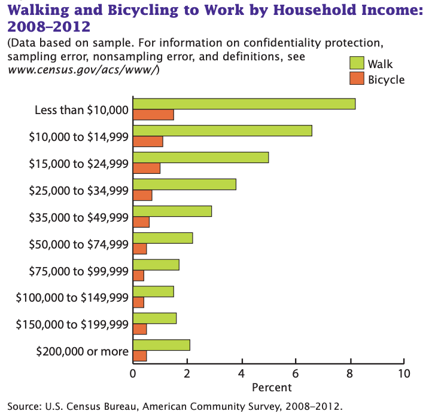
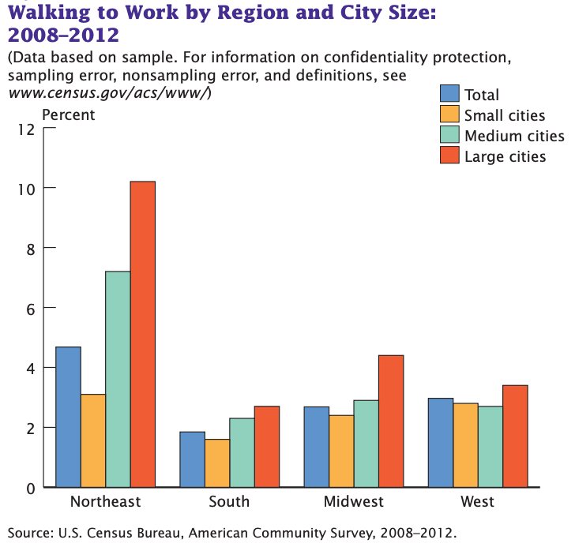

# Modes Less Traveled - Bicycling and Walking to Work in the United States: 2008-2012

This week's data is from the [ACS Survey](https://www.census.gov/library/publications/2014/acs/acs-25.html?#). The article and underlying data can be found at the [Census Website](https://www.census.gov/library/publications/2014/acs/acs-25.html?#). The PDF report is also available for [download](/data/2019/2019-11-05/acs-25.pdf) if you'd like to try reading in some of the embedded tables.

Please note that the raw excel files are uploaded (6 total), along with the cleaned/tidy data (`commute.csv`). There is also a cleaned up version of Table 3 from the article, which incorporates summary data around age, gender, race, children, income, and education for modes of travel (bike, walk, other). If you work with the ACS table 3 I'd suggest `dplyr::slice()` to grab the specific sub-tables from within it!

# Get the data!

```
commute_mode <- readr::read_csv("https://raw.githubusercontent.com/rfordatascience/tidytuesday/master/data/2019/2019-11-05/commute.csv")
```

# Data Dictionary

## `commute.csv`

|variable     |class     |description |
|:--- |:---|:-----------|
|city         |character | City|
|state        |character |State|
|city_size    |character |City Size <br>* Small = 20K to 99,999 <br>* Medium = 100K to 199,999 <br>* Large = >= 200K  |
|mode         |character | Mode of transport, either walk or bike|
|n            |double    |N of individuals|
|percent      |double    |Percent of total individuals|
|moe          |double    |Margin of Error (percent)|
|state_abb    |character |Abbreviated state name |
|state_region |character |ACS State region|

# Spoilers






# Cleaning Script

```{r}

# Load Packages -----------------------------------------------------------

library(tidyverse)
library(readxl)
library(here)
library(glue)
library(janitor)

# Read in Data ------------------------------------------------------------

table_num <- 1:6

# Generic read function for this dataset

supp_read <- function(number, ...){
  read_excel(here("2019", "2019-11-05", glue::glue("supplemental-table{number}.xlsx")), ...)
}

# 3 datasets for bikes, each of which has a corresponding City Size

small_bike <- supp_read(1, skip = 5) %>% 
  clean_names() %>% 
  mutate(city_size = "Small", 
         percentage_of_workers = as.numeric(percentage_of_workers),
         margin_of_error_2 = as.numeric(margin_of_error_2))

medium_bike <- supp_read(2, skip = 5) %>% 
  clean_names() %>% 
  mutate(city_size = "Medium")

large_bike <- supp_read(3, skip = 5) %>% 
  clean_names() %>% 
  mutate(city_size = "Large")

# Combine datasets

full_bike <- bind_rows(small_bike, medium_bike, large_bike) %>% 
  set_names(nm = c("city", "n", "percent", "moe", "city_size")) %>% 
  mutate(mode = "Bike")


# 3 datasets for walking, each of which has a corresponding City Size

small_walk <- supp_read(4, skip = 5) %>% 
  clean_names() %>% 
  mutate(city_size = "Small")

medium_walk <- supp_read(5, skip = 5) %>% 
  clean_names() %>% 
  mutate(city_size = "Medium")

large_walk <- supp_read(6, skip = 5) %>% 
  clean_names() %>% 
  mutate(city_size = "Large")

# Combine datasets

full_walk <- bind_rows(small_walk, medium_walk, large_walk) %>% 
  set_names(nm = c("city", "n", "percent", "moe", "city_size")) %>% 
  mutate(mode = "Walk")

# Built in state-level datasets
state_df <- tibble(
  state = state.name,
  state_abb = state.abb,
  state_region = as.character(state.region)
)

# Combine bike and walk data in tidy setup

full_commute <- 
  bind_rows(full_bike, full_walk) %>% 
  filter(!is.na(n),
         # There are some government-related areas that don't align with cities
         !str_detect(tolower(city), "government|goverment")) %>% 
  separate(city, into = c("city", "state"), sep = ", ") %>% 
  select(city, state, city_size, mode, everything()) %>% 
  left_join(state_df, by = c("state"))

full_commute %>% 
  write_csv(here("2019", "2019-11-05", "commute.csv"))

# ACS Data ----------------------------------------------------------------

acs_data <- read_csv(here("2019", "2019-11-05", "table_3.csv"))

age_data <- acs_data %>% 
  slice(1:6)

gender_data <- acs_data %>% 
  slice(9:10) %>% 
  rename("gender" = age)

race_data <- acs_data %>% 
  slice(13:18) %>% 
  rename("race" = age)

children_data <- acs_data %>% 
  slice(21:24) %>% 
  rename("children" = age)

income_data <- acs_data %>% 
  slice(27:36) %>% 
  rename("income" = age)

education_data <- acs_data %>% 
  slice(39:43) %>% 
  rename("education" = age)


```
